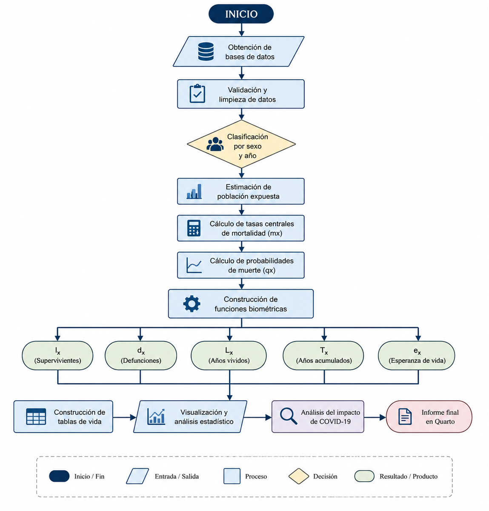
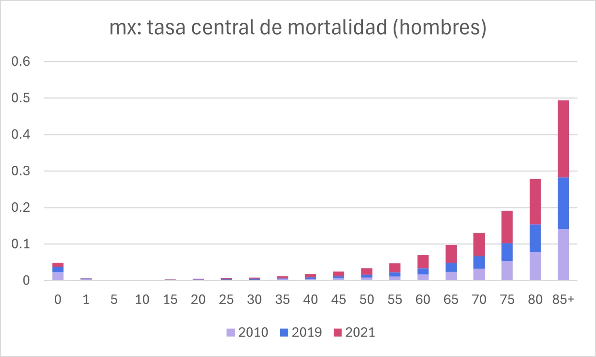
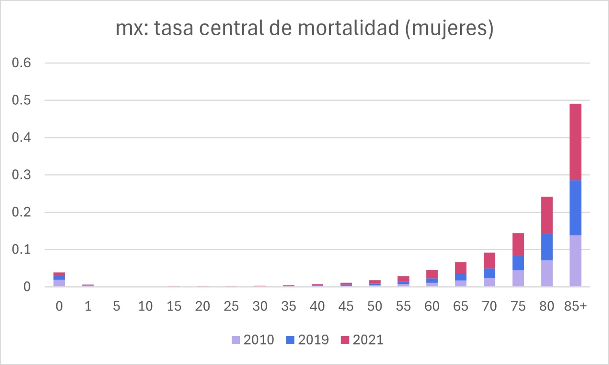
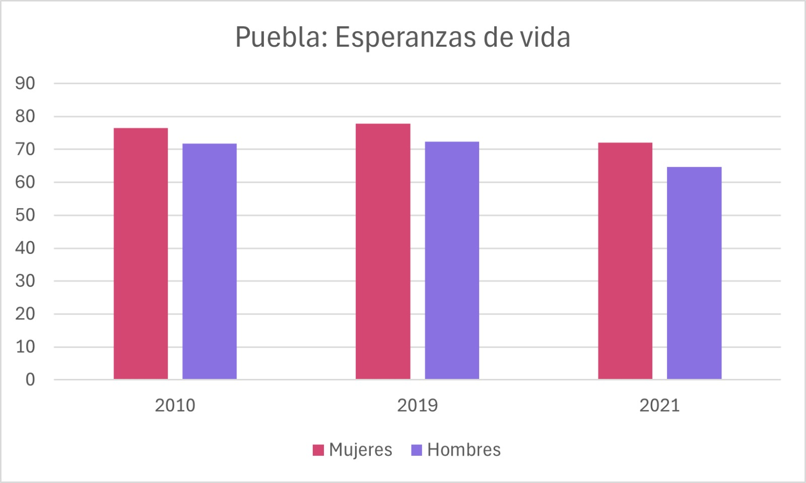
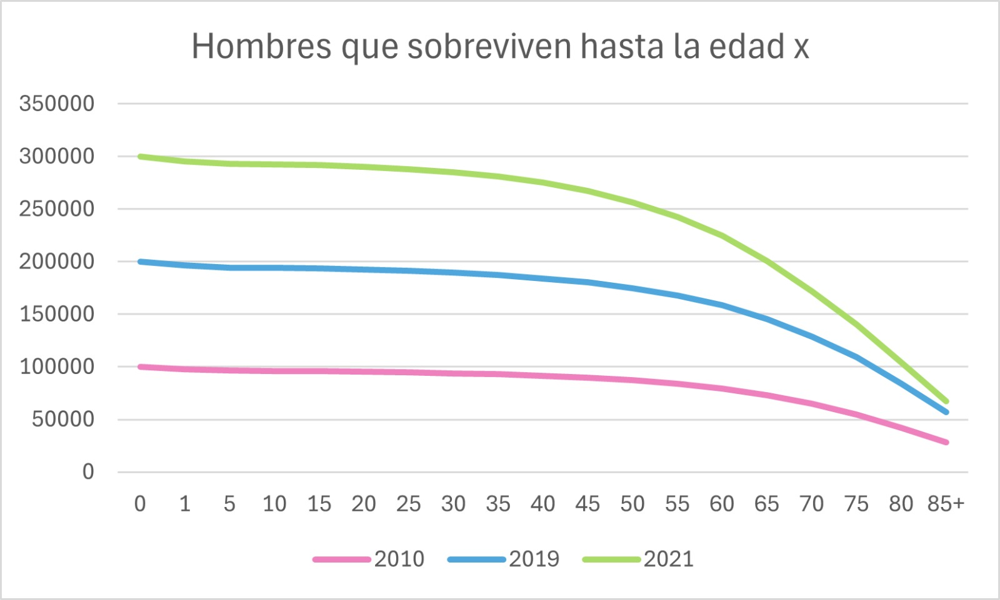
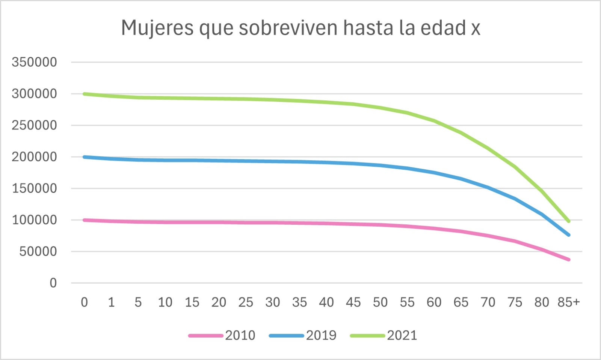
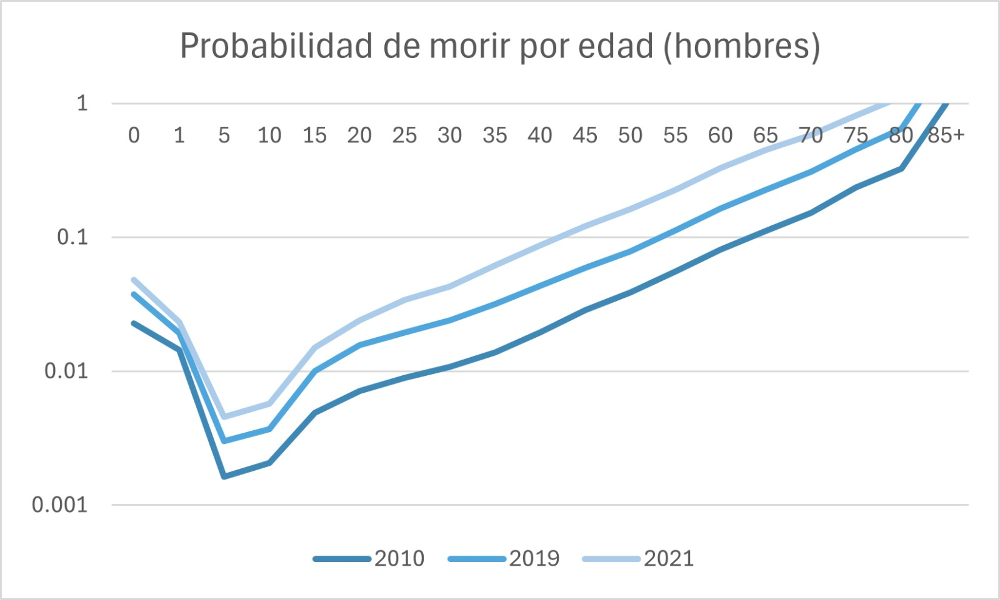
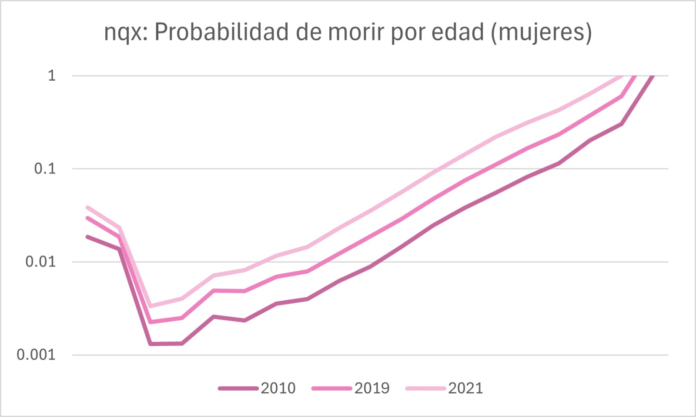
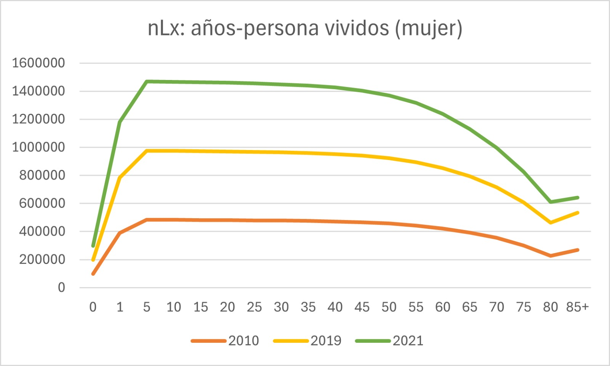
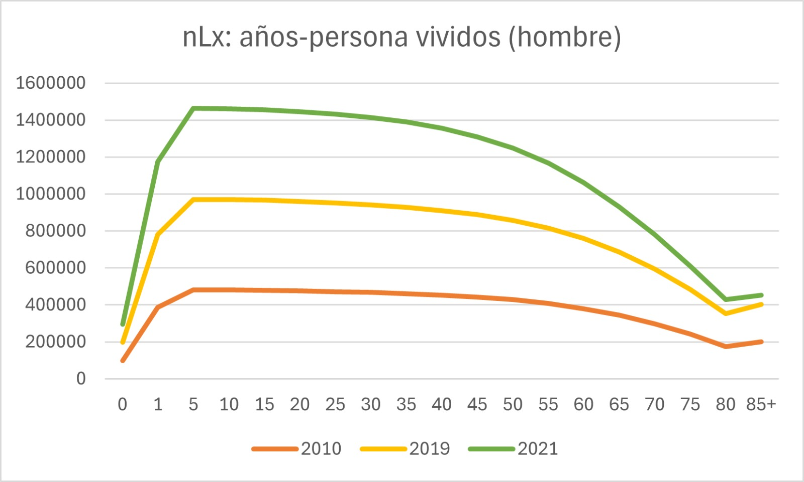

## 

## INTRODUCCIÓN

El análisis demográfico constituye una herramienta fundamental para comprender la dinámica poblacional y su impacto en el desarrollo social, económico y territorial. En el contexto del estado de Puebla, el estudio de variables como el crecimiento poblacional, la estructura por edades, la migración y la distribución geográfica permite identificar tendencias que influyen directamente en la planeación de políticas públicas. Además, el análisis demográfico facilita la evaluación de necesidades futuras en sectores clave como educación, salud, vivienda y empleo, contribuyendo a la toma de decisiones estratégicas a nivel estatal.

Dentro del marco nacional de México, los cambios demográficos han mostrado transformaciones importantes en las últimas décadas, como la transición demográfica, la urbanización acelerada y los movimientos migratorios internos. Instituciones como el INEGI y el CONAPO proporcionan información estadística confiable que permite analizar estos fenómenos con rigor metodológico. La utilización de estas fuentes oficiales garantiza que el proyecto demográfico tenga bases sólidas para el análisis y la proyección de escenarios futuros.

Por lo tanto, el presente proyecto busca generar un diagnóstico demográfico integral que permita comprender la situación actual y las perspectivas futuras de la población en Puebla. A través del análisis de indicadores demográficos clave y el uso de metodologías estadísticas, se pretende aportar información relevante que sirva como base para la formulación de estrategias de desarrollo sostenible, contribuyendo al bienestar social y al crecimiento equilibrado del estado en el mediano y largo plazo.

# Metodología

## Diagrama de Flujo Metodológico

El siguiente diagrama resume el procedimiento metodológico utilizado para la construcción y análisis de las tablas de vida del estado de Puebla.

::: {align="center"}
{width="105%"}
:::

## Lectura del primer objeto en la web

Lectura de la tabla de población mitad de año de las estimaciones-proyecciones de población de México.

## 

```{r}
#| echo: false
#| warning: false
#| message: false

# 1. Remover los objetos
rm(list = ls())

# 2. Instalar paquetes install.packages("data.table", dependencies = T)
#install.packages("kableExtra", 
                 #dependencies = T)
#install.packages("lubridate",
                 #dependencies = T)
#2.5
library(data.table)
library(ggplot2)
library(dplyr)
library(tidyr)
library(kableExtra)
library(lubridate)
# 3. Descargar tablas de datos
pop <- fread("https://repodatos.atdt.gob.mx/CONAPO/proyecciones/00_Pob_Mitad_1950_2070.csv")


mort <- fread("https://population.un.org/wpp/assets/Excel%20Files/1_Indicator%20(Standard)/CSV_FILES/WPP2024_DeathsBySingleAgeSex_Medium_1950-2023.csv.gz")

apv <- fread ("https://population.un.org/wpp/assets/Excel%20Files/1_Indicator%20(Standard)/CSV_FILES/WPP2024_PopulationByAge5GroupSex_Medium.csv.gz")

#pop <- fread("data/00_Pob_Mitad_1950_2070")

# 4. Exploración de la tabla de población
table(pop$ENTIDAD)
table(pop$CVE_GEO)
table(pop$ANIO)

names(pop)
sum(pop$POBLACION)
```

**Pirámide poblacional de Puebla del año 2026.**

```{r, echo=FALSE, fig.height=5,fig.with=8}
# Filtrar datos
puebla <- pop[ENTIDAD == "Puebla" & ANIO == 2026,
              .(SEXO, EDAD, POBLACION)]

# Crear variable negativa para hombres
puebla$POBLACION2 <- ifelse(puebla$SEXO == "Hombres",
                            -puebla$POBLACION,
                            puebla$POBLACION)

# Calcular máximo absoluto para simetría
max_val <- max(abs(puebla$POBLACION2))

# Gráfica
ggplot(puebla, aes(x = EDAD, y = POBLACION2, fill = SEXO)) +
  geom_bar(stat = "identity", width = 0.8) +
  coord_flip() +
  geom_hline(yintercept = 0, color = "#333333", linewidth = 0.4) +
  scale_y_continuous(
  breaks = sort(unique(c(seq(-max_val, max_val, by = 20000), 0))),
  labels = function(x) scales::comma(abs(x)),
  limits = c(-max_val, max_val),
  expand = c(0, 0)
  ) +

  scale_fill_manual(values = c("Hombres" = "#355070",
                               "Mujeres" = "#C06C84")) +
  labs(
    title = "Pirámide poblacional de Puebla, 2026",
    subtitle = "Estimaciones y proyecciones de población a mitad de año",
    x = "Edad",
    y = "Población",
    caption = "Fuente: CONAPO, Proyecciones de la población de México 1950–2070"
  ) +
  theme_minimal() +
  theme(
    plot.title = element_text(face = "bold", size = 14, hjust = 0.5),
    plot.subtitle = element_text(size = 11, hjust = 0.5),
    axis.text.y = element_text(size = 6),
    legend.position = "bottom",
    legend.title = element_blank()
  )
```

La pirámide muestra que el grupo 0-14 años es ligeramente más ancho que varios tramos jóvenes-adultos (sobre todo 25-39), lo que indica que la natalidad no está cayendo bruscamente sino que se mantiene relativamente estable. El mayor volumen se concentra aproximadamente entre 10 y 29 años, formando una base amplia característica de una población joven. A partir de los 40 años el tamaño disminuye de manera continua y después de los 70 la reducción es más acelerada, por lo que el envejecimiento todavía es moderado; la parte superior es estrecha y no domina la estructura.

En conjunto, Puebla presenta una estructura aún joven-expansiva moderada, con crecimiento demográfico activo y predominio de población infantil y juvenil, más cercana a una etapa intermedia de transición demográfica que a una población envejecida; económicamente esto implica mayor presión en educación, empleo y generación de oportunidades laborales antes que en sistemas de pensiones o atención geriátrica.

**Pirámide poblacional de Puebla del año 2026.**

```{r, echo=FALSE, fig.height=5,fig.with=8}
# Filtrar datos
puebla <- pop[ENTIDAD == "Puebla" & ANIO == 2070,
              .(SEXO, EDAD, POBLACION)]

# Crear variable negativa para hombres
puebla$POBLACION2 <- ifelse(puebla$SEXO == "Hombres",
                            -puebla$POBLACION,
                            puebla$POBLACION)

# Calcular máximo absoluto para simetría
max_val <- max(abs(puebla$POBLACION2))

# Gráfica
ggplot(puebla, aes(x = EDAD, y = POBLACION2, fill = SEXO)) +
  geom_bar(stat = "identity", width = 0.8) +
  coord_flip() +
  geom_hline(yintercept = 0, color = "#333333", linewidth = 0.4) +
  scale_y_continuous(
  breaks = sort(unique(c(seq(-max_val, max_val, by = 20000), 0))),
  labels = function(x) scales::comma(abs(x)),
  limits = c(-max_val, max_val),
  expand = c(0, 0)
  ) +

scale_fill_manual(values = c("Hombres" = "#E6D5B8",
                             "Mujeres" = "#5A1E36")) +
  labs(
    title = "Pirámide poblacional de Puebla, 2070",
    subtitle = "Estimaciones y proyecciones de población a mitad de año",
    x = "Edad",
    y = "Población",
    caption = "Fuente: CONAPO, Proyecciones de la población de México 1950–2070"
  ) +
  theme_minimal() +
  theme(
    plot.title = element_text(face = "bold", size = 14, hjust = 0.5),
    plot.subtitle = element_text(size = 11, hjust = 0.5),
    axis.text.y = element_text(size = 6),
    legend.position = "bottom",
    legend.title = element_blank()
  )

```

La pirámide poblacional proyectada para Puebla en 2070 no muestra una base extremadamente estrecha ni una cúspide más ancha que el centro, sino una estructura casi estacionaria con tendencia al envejecimiento moderado. Los grupos en edades adultas (aproximadamente entre 30 y 60 años) concentran el mayor volumen poblacional, lo que indica que aún predomina la población en edad productiva. La base infantil es menor que los grupos centrales, lo que confirma una fecundidad reducida respecto a décadas pasadas, pero no evidencia una contracción drástica. En la parte superior se observa un aumento progresivo de población adulta mayor, aunque no supera en magnitud a los grupos medios; por tanto, el envejecimiento es claro pero no extremo. También se aprecia una ligera mayor presencia femenina en edades avanzadas, coherente con la mayor esperanza de vida de las mujeres. En conjunto, la estructura sugiere una transición demográfica avanzada pero aún con un peso importante de población económicamente activa.

En términos económicos, esta composición implica que Puebla en 2070 todavía contaría con una base significativa de población en edad laboral, lo que podría sostener la actividad productiva si se mantienen niveles adecuados de empleo y productividad. Sin embargo, el crecimiento de los grupos de 60 años y más incrementará gradualmente la presión sobre los sistemas de salud y pensiones, aunque no en un escenario de sobreenvejecimiento extremo. La economía estatal tendría que adaptarse a una demanda creciente de servicios médicos y de cuidado, al tiempo que aprovecha el amplio contingente adulto mediante inversión en capacitación, tecnología y generación de empleo formal para sostener el equilibrio entre población dependiente y productiva.

# Contexto demográfico de Puebla

Puebla es una de las entidades con mayor población del país y presenta
una distribución heterogénea entre zonas urbanas y rurales. Esta 
característica puede influir directamente en los niveles de mortalidad 
debido a diferencias en acceso a servicios de salud, infraestructura y 
condiciones socioeconómicas.

Con fines analíticos se consideran los siguientes indicadores:

• Densidad poblacional: Puebla concentra población en áreas metropolitanas 
como Puebla-Tlaxcala, lo que puede modificar patrones de riesgo 
epidemiológico.

• Porcentaje de población en pobreza: niveles elevados pueden asociarse
con acceso desigual a servicios médicos y condiciones preventivas.

• Índice de envejecimiento: el incremento de población adulta mayor
modifica los patrones esperados de mortalidad y supervivencia.

Estos indicadores permiten contextualizar posteriormente los cambios 
observados en esperanza de vida, tasas de mortalidad y supervivencia.

##Escritura de funciones

Para la construcción de las tablas de vida del estado de Puebla se emplearon 
las fórmulas actuariales clásicas, siguiendo la metodología estándar utilizada 
en demografía formal y análisis de mortalidad. En particular, se tomó como
base el enfoque tradicional de tablas de vida presentado en Watcher, 
complementado con la formalización teórica descrita en Preston, 
Heuveline y Guillot (2001).

En este trabajo se utiliza una **tabla de vida abreviada**, con intervalos de edad de amplitud $n = 5$ años, lo cual es consistente con la disponibilidad de información estadística y la práctica común en estudios demográficos.

A continuación, se describen los principales indicadores empleados en la construcción de la tabla de vida.


```{r echo=FALSE, warning=FALSE, message=FALSE}
library(readxl)
library(knitr)
library(kableExtra)

archivo <- "C:/Users/angel/Documents/DEMOGRAFÍA/DEMOGRAPHY_9219/data/Tablas de mortalidad 2010,2019 y 2021.xlsx"

# =========================
# Femenina 2010
# =========================

fem2010 <- read_excel(
  archivo,
  sheet = "Mortalidad femenina 2010",
  skip = 1
)

landscape(
  kbl(fem2010, caption = "Mortalidad femenina 2010") %>%
    kable_styling(
      latex_options = c("scale_down"),
      font_size = 7
    )
)

# =========================
# Masculina 2010
# =========================

mas2010 <- read_excel(
  archivo,
  sheet = "Mortalidad masculina 2010",
  skip = 1
)

landscape(
  kbl(mas2010, caption = "Mortalidad masculina 2010") %>%
    kable_styling(
      latex_options = c("scale_down"),
      font_size = 7
    )
)

# =========================
# Femenina 2019
# =========================

fem2019 <- read_excel(
  archivo,
  sheet = "Mortalidad femenina 2019",
  skip = 1
)

landscape(
  kbl(fem2019, caption = "Mortalidad femenina 2019") %>%
    kable_styling(
      latex_options = c("scale_down"),
      font_size = 7
    )
)

# =========================
# Masculina 2019
# =========================

mas2019 <- read_excel(
  archivo,
  sheet = "Mortalidad masculina 2019",
  skip = 1
)

landscape(
  kbl(mas2019, caption = "Mortalidad masculina 2019") %>%
    kable_styling(
      latex_options = c("scale_down"),
      font_size = 7
    )
)

# =========================
# Femenina 2021
# =========================

fem2021 <- read_excel(
  archivo,
  sheet = "Mortalidad femenina 2021",
  skip = 1
)

landscape(
  kbl(fem2021, caption = "Mortalidad femenina 2021") %>%
    kable_styling(
      latex_options = c("scale_down"),
      font_size = 7
    )
)

# =========================
# Masculina 2021
# =========================

mas2021 <- read_excel(
  archivo,
  sheet = "Mortalidad masculina 2021",
  skip = 1
)

landscape(
  kbl(mas2021, caption = "Mortalidad masculina 2021") %>%
    kable_styling(
      latex_options = c("scale_down"),
      font_size = 7
    )
)
```


------------------------------------------------------------------------

### Tasa central de mortalidad

La tasa central de mortalidad se define como:

$$
m_x = \frac{D_x}{N_x}
$$

donde: - $D_x$ representa el número de defunciones observadas en el grupo de edad $x$, - $N_x$ es la población expuesta al riesgo en dicho grupo.

------------------------------------------------------------------------

### Probabilidad de morir

La probabilidad de morir entre las edades $x$ y $x+n$ se calcula como:

$$
q_x = \frac{n \cdot m_x}{1 + (n - a_x) \cdot m_x}
$$

donde: - $n$ es la amplitud del intervalo de edad (en este caso, $n = 5$), - $a_x$ es la fracción promedio del intervalo vivido por quienes fallecen (usualmente $a_x = 0.5$ para edades intermedias).

------------------------------------------------------------------------

### Probabilidad de sobrevivir

La probabilidad de sobrevivir se define como:

$$
p_x = 1 - q_x
$$

------------------------------------------------------------------------

### Función de sobrevivientes

El número de sobrevivientes a la edad $x+n$ se obtiene mediante:

$$
l_{x+n} = l_x \cdot p_x = l_x (1 - q_x)
$$

donde $l_0 = 100,000$ representa el tamaño inicial de la cohorte hipotética.

------------------------------------------------------------------------

### Defunciones en la tabla de vida

El número de defunciones en el intervalo se calcula como:

$$
d_x = l_x - l_{x+n}
$$

------------------------------------------------------------------------

### Años vividos en el intervalo

El número de años vividos entre $x$ y $x+n$ se estima como:

$$
L_x = n \cdot l_{x+n} + a_x \cdot d_x
$$

------------------------------------------------------------------------

### Total de años por vivir

El total de años que le restan por vivir a la cohorte a partir de la edad $x$ se define como:

$$
T_x = \sum_{y \geq x} L_y
$$

------------------------------------------------------------------------

### Esperanza de vida

La esperanza de vida a la edad $x$ se calcula como:

$$
e_x = \frac{T_x}{l_x}
$$

En particular, la esperanza de vida al nacer corresponde a $e_0$.

------------------------------------------------------------------------

### Modelo de crecimiento exponencial

Para complementar el análisis demográfico, se considera el modelo de crecimiento exponencial:

$$
P(t) = P_0 e^{rt}
$$

donde: - $P(t)$ es la población en el tiempo $t$, - $P_0$ es la población inicial, - $r$ es la tasa de crecimiento, - $e$ es la base de los logaritmos naturales.

------------------------------------------------------------------------

En conjunto, estas expresiones permiten construir de manera sistemática la tabla de vida abreviada a partir de la información observada de defunciones y población por grupos de edad.

------------------------------------------------------------------------
## Cuadro con las esperanzas de vida

```{r echo=FALSE, warning=FALSE, message=FALSE}
library(readxl)
library(knitr)
library(kableExtra)

archivo <- "C:/Users/angel/Documents/DEMOGRAFÍA/DEMOGRAPHY_9219/data/Cuadro esperanzas de vida.xlsx"

esperanza_vida <- read_excel(
  archivo,
  skip = 2
)

kable(
  esperanza_vida,
  caption = "Esperanzas de vida por sexo y año"
) %>%
  kable_styling(
    full_width = FALSE,
    bootstrap_options = c("striped", "hover", "condensed")
  )
```

## Crecimiento exponencial de la población de Puebla

```{r}
#| echo: false
#| warning: false
#| message: false

library(data.table)
library(ggplot2)
library(lubridate)
library(dplyr)
library(scales)

# =========================
# Población total Puebla
# =========================

K_0 <- pop[
  ENTIDAD == "Puebla" &
  ANIO == 2010,
  sum(POBLACION)
]

K_T <- pop[
  ENTIDAD == "Puebla" &
  ANIO == 2021,
  sum(POBLACION)
]

# =========================
# Función exponencial
# =========================

expo <- function(K_0, K_T, t_0, t_T, t){

  t0_dec <- decimal_date(as.Date(t_0))
  tT_dec <- decimal_date(as.Date(t_T))

  dt <- tT_dec - t0_dec

  r <- log(K_T / K_0) / dt

  h <- t - t0_dec

  K_h <- K_0 * exp(r * h)

  return(K_h)
}

# =========================
# Proyección
# =========================

proy <- expo(
  K_0 = K_0,
  K_T = K_T,
  t_0 = "2010-01-01",
  t_T = "2021-01-01",
  t = seq(2010, 2070, 1)
)

# =========================
# Base gráfica
# =========================

datos_exp <- data.frame(
  Año = seq(2010, 2070, 1),
  Poblacion = proy
)

# Agregar puntos observados
obs <- data.frame(
  Año = c(2010, 2021),
  Poblacion = c(K_0, K_T)
)

# =========================
# Gráfica
# =========================

ggplot(datos_exp, aes(Año, Poblacion)) +

  geom_line(
    linewidth = 1.2,
    color = "#355070"
  ) +

  geom_point(
    data = obs,
    aes(Año, Poblacion),
    size = 3,
    color = "#C06C84"
  ) +

  scale_y_continuous(
    labels = comma
  ) +

  labs(
    title = "Proyección exponencial de la población de Puebla",
    subtitle = "Modelo basado en la población observada entre 2010 y 2021",
    x = "Año",
    y = "Población",
    caption = "Fuente: CONAPO, Proyecciones de población"
  ) +

  theme_minimal() +

  theme(
    plot.title = element_text(
      face = "bold",
      size = 15,
      hjust = 0.5
    ),

    plot.subtitle = element_text(
      size = 11,
      hjust = 0.5
    ),

    axis.title = element_text(
      face = "bold"
    )
  )
```

#Tasas brutas y especificas

```{r}
#| echo: false
#| warning: false
#| message: false

library(ggplot2)
library(dplyr)
library(data.table)
library(scales)

# =========================================
# CONVERTIR COLUMNAS A NUMÉRICAS
# =========================================

fem2021 <- fem2021 %>%
  mutate(
    `x (edad)` = as.numeric(`x (edad)`),
    nmx = as.numeric(nmx),
    nqx = as.numeric(nqx),
    lx = as.numeric(lx),
    `...13` = as.numeric(`...13`)
  )

mas2021 <- mas2021 %>%
  mutate(
    `x (edad)` = as.numeric(`x (edad)`),
    nmx = as.numeric(nmx),
    nqx = as.numeric(nqx),
    lx = as.numeric(lx),
    `...13` = as.numeric(`...13`)
  )

# =========================================
# ESPERANZA DE VIDA POR SEXO
# =========================================

ev_f <- fem2021 %>%
  mutate(Sexo = "Mujeres")

ev_m <- mas2021 %>%
  mutate(Sexo = "Hombres")

bind_rows(ev_f, ev_m) %>%

ggplot(aes(`x (edad)`, `...13`, color = Sexo)) +

  geom_line(linewidth = 1.3) +

  labs(
    title = "Esperanza de vida por sexo, Puebla 2021",
    x = "Edad",
    y = "Esperanza de vida"
  ) +

  theme_minimal()

cat("Interpretación: Esperanza de vida por sexo, Puebla 2021

La gráfica de esperanza de vida muestra que las mujeres presentan 
valores superiores a los hombres en prácticamente todos los 
grupos de edad. Esto refleja el patrón demográfico observado 
a nivel nacional e internacional, donde la mortalidad masculina 
suele ser más elevada debido a factores biológicos, sociales y conductuales.

Asimismo, la esperanza de vida disminuye progresivamente conforme aumenta
la edad, ya que el número promedio de años restantes por vivir se reduce
con el envejecimiento. Sin embargo, la diferencia entre ambos sexos se
mantiene relativamente constante, evidenciando una mayor supervivencia
femenina a lo largo del ciclo de vida.

En términos demográficos, este comportamiento sugiere que 
la población femenina tenderá a representar una proporción
más alta en edades avanzadas, lo cual tiene implicaciones 
importantes para la planificación de servicios de salud, 
seguridad social y cuidados geriátricos.")

# =========================================
# FUNCIÓN DE SOBREVIVENCIA
# =========================================

ggplot(fem2021,
       aes(`x (edad)`, lx)) +

  geom_line(
    linewidth = 1.3,
    color = "#355070"
  ) +

  labs(
    title = "Función de sobrevivencia femenina",
    x = "Edad",
    y = "Sobrevivientes lx"
  ) +

  theme_minimal()

cat("Función de sobrevivencia femenina

La función de sobrevivencia femenina presenta una disminución gradual
conforme aumenta la edad, lo cual representa la reducción progresiva 
del número de sobrevivientes de la cohorte hipotética inicial.

Durante las primeras edades la curva se mantiene relativamente
alta y estable, indicando bajos niveles de mortalidad infantil y juvenil.
Posteriormente, la reducción se vuelve más acelerada en edades adultas
avanzadas y vejez, donde el riesgo de mortalidad aumenta considerablemente.

Este comportamiento refleja una transición demográfica avanzada, 
caracterizada por mejores condiciones sanitarias, reducción de 
enfermedades infecciosas y aumento de la supervivencia en edades
tempranas, aunque todavía persiste una mortalidad importante en
edades mayores asociada al envejecimiento poblacional.")

# =========================================
# PROBABILIDAD DE MORIR
# =========================================

ggplot(fem2021,
       aes(`x (edad)`, nqx)) +

  geom_line(
    linewidth = 1.3,
    color = "#C06C84"
  ) +

  labs(
    title = "Probabilidad de morir por edad",
    x = "Edad",
    y = "nqx"
  ) +

  theme_minimal()

cat("La probabilidad de morir permanece reducida durante las edades
infantiles y juveniles, pero a partir de aproximadamente los 60 años
presenta un crecimiento acelerado. Este comportamiento indica una
concentración del riesgo de mortalidad en edades avanzadas y coincide
con patrones demográficos esperados en poblaciones con transición
demográfica avanzada. Desde una perspectiva actuarial, este comportamiento
es relevante para estimar riesgos asociados con supervivencia y esperanza
de vida.")


# =========================================
# MORTALIDAD POR SEXO
# =========================================

mort_f <- fem2021 %>%
  mutate(Sexo = "Mujeres")

mort_m <- mas2021 %>%
  mutate(Sexo = "Hombres")

bind_rows(mort_f, mort_m) %>%

ggplot(aes(`x (edad)`, nmx, color = Sexo)) +

  geom_line(linewidth = 1.3) +

  labs(
    title = "Tasa central de mortalidad por sexo",
    x = "Edad",
    y = "nmx"
  ) +

  theme_minimal()

cat("Las tasas centrales de mortalidad presentan una trayectoria creciente
a lo largo del ciclo de vida. Se observa una sobremortalidad masculina
en la mayoría de grupos de edad, particularmente durante edades adultas
y avanzadas. Este diferencial implica una menor permanencia esperada
de hombres dentro de la cohorte y explica parte de la brecha observada
en esperanza de vida.")

# =========================================
# CRECIMIENTO POBLACIONAL
# =========================================

crecimiento <- pop[
  ENTIDAD == "Puebla",
  .(Poblacion = sum(POBLACION)),
  by = ANIO
]

ggplot(crecimiento,
       aes(ANIO, Poblacion)) +

  geom_line(
    linewidth = 1.3,
    color = "#355070"
  ) +

  scale_y_continuous(
    labels = comma
  ) +

  labs(
    title = "Crecimiento poblacional de Puebla",
    x = "Año",
    y = "Población"
  ) +

  theme_minimal()

cat("La población de Puebla presenta una tendencia creciente durante
el periodo observado, aunque con una pendiente relativamente moderada.
Este comportamiento sugiere una desaceleración gradual del crecimiento
demográfico asociada con menores niveles de fecundidad y cambios en
la estructura poblacional. Desde una perspectiva actuarial, estas
modificaciones afectan la composición futura del riesgo y la demanda
esperada de servicios.")

# =========================================
# MORTALIDAD LOGARÍTMICA
# =========================================

ggplot(fem2021,
       aes(`x (edad)`, log(nmx))) +

  geom_line(
    linewidth = 1.3,
    color = "#5A1E36"
  ) +

  labs(
    title = "Logaritmo de la mortalidad femenina",
    x = "Edad",
    y = "log(nmx)"
  ) +

  theme_minimal()
cat("Mortalidad logarítmica femenina

La gráfica del logaritmo de la mortalidad femenina presenta una tendencia 
creciente casi lineal conforme aumenta la edad. Esto indica que la 
mortalidad se incrementa de manera aproximadamente exponencial en
edades adultas y avanzadas.

El uso de la escala logarítmica permite visualizar con mayor claridad 
los cambios relativos en la mortalidad y evidencia que el riesgo de 
fallecimiento aumenta progresivamente con el envejecimiento biológico.

Este patrón es consistente con la ley de Gompertz, ampliamente utilizada 
en demografía y actuaría, la cual establece que la mortalidad humana
crece exponencialmente con la edad adulta. Por ello, la gráfica 
confirma que la estructura de mortalidad femenina en Puebla sigue
comportamientos demográficos esperados en poblaciones modernas.")

```


```{r}
#| echo: false
#| fig-align: center
#| out-width: 85%



```

```{r}
#| echo: false
#| results: asis

cat("
Las tasas centrales de mortalidad de hombres y mujeres presentan un
patrón creciente conforme avanza la edad, con niveles muy bajos en edades 
infantiles y juveniles y aumentos acelerados después de los 60 años. En ambos
sexos, 2021 registra valores superiores a 2010 y 2019, especialmente en
edadesavanzadas, reflejando un incremento reciente de la mortalidad. 
Sin embargo,los hombres mantienen niveles más altos que las mujeres en casi
todos losgrupos de edad, lo que evidencia una mayor vulnerabilidad masculina y 
contribuye a las diferencias observadas en esperanza de vida entre ambos sexos.

")
```


```{r}
#| echo: false
#| fig-align: center
#| out-width: 85%


```

```{r}
#| echo: false
#| results: asis

cat("
En Puebla, las mujeres presentan mayor esperanza de vida que los hombres
en todos los años analizados. Entre 2010 y 2019 hubo un ligero aumento, 
mientras que en 2021 ambos grupos registraron una disminución importante. 
La reducción fue más fuerte en hombres, ampliando así la diferencia respecto
a las mujeres.
")
```


```{r}
#| echo: false
#| fig-align: center
#| out-width: 85%



```

```{r}
#| echo: false
#| results: asis

cat("
Las gráficas muestran que, conforme aumenta la edad, disminuye la 
cantidad de personas sobrevivientes. En los tres años analizados, 
las mujeres presentan mayores niveles de supervivencia respecto a 
los hombres. Además, 2021 registra las cifras más altas de sobrevivencia,
mientras que 2010 muestra los valores más bajos, especialmente en
edades avanzadas.
")
```


```{r}
#| echo: false
#| fig-align: center
#| out-width: 85%



```

```{r}
#| echo: false
#| results: asis

cat("
Las gráficas indican que la probabilidad de morir aumenta 
conforme avanza la edad. En ambos sexos, 2021 presenta los niveles
más altos de mortalidad y 2010 los más bajos. Además, los hombres 
muestran probabilidades de muerte ligeramente superiores a las mujeres,
especialmente en edades adultas y avanzadas de la vida.
")
```

```{r}
#| echo: false
#| fig-align: center
#| out-width: 85%



```

```{r}
#| echo: false
#| results: asis

cat("Los años-persona vividos muestran mayores niveles en edades
tempranas y medias, alcanzando su máximo alrededor de los primeros
grupos etarios y disminuyendo posteriormente. La reducción observada
después de edades avanzadas se asocia con el incremento del riesgo
de mortalidad y la disminución del número de sobrevivientes.")
```

### g) Análisis de resultados y efecto de la COVID-19 en Puebla

Los resultados muestran que Puebla presenta una evolución demográfica
asociada con una transición demográfica avanzada, conservando 
características de una población relativamente joven. Entre 2010 y 2019 
se observa una mejora en los indicadores: aumentó la esperanza de vida,
disminuyó la mortalidad en edades tempranas y se registraron mayores
niveles de supervivencia. Desde una perspectiva actuarial, este comportamiento
refleja mejoras en las condiciones de salud y en la permanencia de 
la población dentro de la cohorte de sobrevivientes.

Una característica relevante de Puebla es la heterogeneidad 
entre zonas urbanas y rurales, lo que puede generar diferencias en 
mortalidad y acceso a servicios de salud, afectando la estructura
de riesgo poblacional.

En 2021 se identifican cambios asociados al impacto de la COVID-19.
Los indicadores muestran incrementos en las tasas de mortalidad y 
en la probabilidad de morir, principalmente en edades adultas y 
avanzadas. Asimismo, la esperanza de vida disminuyó respecto a los
años previos, con un efecto más notable en hombres.

Desde un enfoque actuarial, la pandemia alteró temporalmente la 
tendencia esperada de mejora en la supervivencia, incrementando 
el riesgo de mortalidad y reduciendo los años-persona vividos. 
Estos resultados evidencian la sensibilidad de los indicadores 
demográficos ante choques epidemiológicos y su relevancia para la 
planeación de salud y estimación futura del riesgo poblacional.


### Referencias

Consejo Nacional de Población (CONAPO). (2024). Proyecciones de población de México y entidades federativas 1950–2070.


Wachter, K. W. (2006). Essential Demographic Methods. Harvard University Press.

Preston, S., Heuveline, P., & Guillot, M. (2001). Demography: Measuring and Modeling Population Processes.
